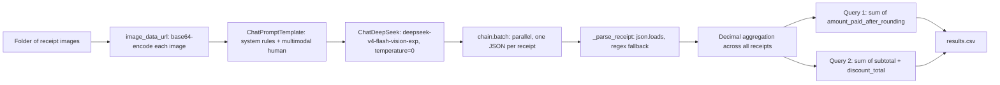

# FTEC5660 Homework 1: Receipt Chain

Build a LangChain pipeline that reads every supermarket receipt in a folder
with the vision-capable DeepSeek Flash model and answers these two questions:

1. How much money did I spend in total for these bills?
2. How much would I have had to pay without the discount?

For this homework, **amount spent** means the final payment after the receipt's
rounding line. **Without the discount** means the sum of the original positive
item prices: add back every promotion, coupon, member, app, packaging-damage,
and percentage discount, but do not add back rounding.

## Student task

Only edit the two functions in `hw1.py` that contain `### YOUR CODE HERE`:

- `build_chain()` creates your LangChain chain.
- `answer_queries()` runs the chain on the receipt images and returns one final
  response for each question.

You may use prompt chaining, routing, parallel calls, reflection, or a
combination. Your final responses should each contain one HKD amount. Do not
hard-code filenames or public answers; grading uses unseen receipt folders.

## Setup and public test

```bash
python3 -m venv .venv
source .venv/bin/activate
pip install -r requirements.txt
```

Put your DeepSeek key after `DEEPSEEK_API_KEY=` in `.env`, then run:

```bash
python3 hw1.py --image-folder public_test
```

The program creates `results.csv` in the current directory. Its columns are
`query`, `model_response`, and `correctness`. The public answers are in
`public_test/ground_truth.json`. The starter intentionally returns the dummy
response `please design your chain to answer these two queries.` so it runs
before you add any API code.

The required model is `deepseek-v4-flash-vision-exp`, the vision-capable
DeepSeek Flash model. JPEG, PNG, GIF, and WebP inputs are accepted by the
homework runner.


## Homework 1 solution:

### Chain design



### Description

I deliberately keep the language model out of the arithmetic. `build_chain()`
creates a single vision chain: a `ChatPromptTemplate` whose system message pins
down the exact receipt semantics (query 1 = the final payment line *after*
ROUNDING; query 2 = SUBTOTAL plus every discount / promotion / coupon / member
/ app / packaging-damage line added back as a positive number, *without* adding
ROUNDING back) and forces the model to reply with a bare JSON object holding
exactly three fields — `amount_paid_after_rounding`, `subtotal` and
`discount_total` — while the human message carries the receipt image as a
base64 data URL through the provided `image_data_url()` helper. A worked
receipt-5-style example is baked into the prompt to anchor the
ROUNDING-versus-SUBTOTAL distinction, and the model is
`ChatDeepSeek("deepseek-v4-flash-vision-exp")` at `temperature=0`.
`answer_queries()` then pushes every receipt through the chain in parallel with
`chain.batch()`, parses each structured reply back into Python `Decimal`s
(`json.loads` first, then a per-field regex fallback so one malformed response
can never crash the run), and aggregates deterministically: query 1 sums the
post-rounding payments, query 2 sums `subtotal + discount_total`. Separating
extraction from arithmetic makes the totals exact and reproducible, and because
each answer is returned as a single `HK$<number>` string it satisfies the
grader's exactly-one-number rule.
